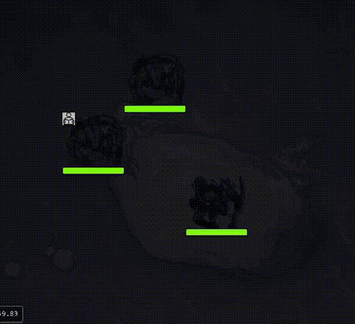
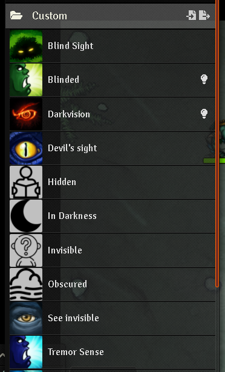
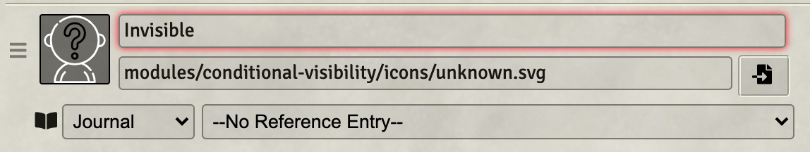
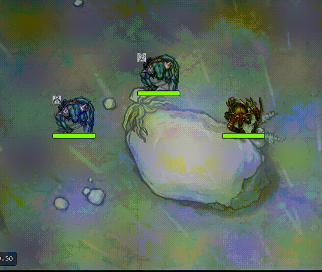

# Conditional Visibility (Reborn 2022)

 

 

### If you want to buy me a coffee 

Invisible Stalkers should only be seen by players that have cast See Invisibility.  Stealthy Goblins should only be seen by players with high perception.
And when that Drow casts Darkness, players should need Devil's Sight to see any tokens inside.

Conditional Visibility allows you to set conditions on tokens that will display them only to players whose senses meet the conditions necessary to see
the token.

**IMPORTANT: This module will work very good with the ligthing setting "Token vision" of scene configuration set to true, otherwise is still work, but is not advisable**

## NOTE: If you are a javascript developer and not a typescript developer, you can just use the javascript files under the dist folder

## Before open any issue 

1) Enable the module setting _"Enable debugging"_
2) Click F12 go to the _console_ tab 
3) make the test you want and replicate the error
4) Go to the tab console open on point 2) and just right click and click 'Save as' and 'Save'.
5) attach the text file on the github issue
6) Wait for a response

## Installation

It's always easiest to install modules from the in game add-on browser.

To install this module manually:
1.  Inside the Foundry "Configuration and Setup" screen, click "Add-on Modules"
2.  Click "Install Module"
3.  In the "Manifest URL" field, paste the following url:
`https://raw.githubusercontent.com/p4535992/conditional-visibility/master/src/module.json`
4.  Click 'Install' and wait for installation to complete
5.  Don't forget to enable the module in game using the "Manage Module" button

### libWrapper

This module uses the [libWrapper](https://github.com/ruipin/fvtt-lib-wrapper) library for wrapping core methods. It is a hard dependency and it is recommended for the best experience and compatibility with other modules.

### socketlib

This module uses the [socketlib](https://github.com/manuelVo/foundryvtt-socketlib) library for wrapping core methods. It is a hard dependency and it is recommended for the best experience and compatibility with other modules.

### ATE (old ATL)

This module uses the [ATE](https://github.com/kandashi/Active-Token-Lighting) library for wrapping methods. It is a hard dependency and it is recommended for the best experience and compatibility with other modules.

## Known Issue\Limitation

- **HELP WANTED FOR PF2E INTEGRATION**, it's seems from my last visit to the PF2E sytem to many things are chnaged, i need some PF2E developer for help me with the intgration (the problem is always the time...)
- HELP WANTED This is just a "fast to make" module maybe someone a little more expert than me with form application and hud layer can do a better form for a better user experience.
- This module used many feature of the [Dfred convenient effects](https://github.com/DFreds/dfreds-convenient-effects/) module, but is not multisystem (yet) i invite you to support Dfred for is marvelous work and beg him to make that module multisystem.
- With levels module enabled and active, **if the scene is with "Token vision" set to false (unchecked box)**, after selected a token and click on the canvas with the option "Release on left click" enable the hidden token are visible for a small instant this is a incompatibility with the [Levels](https://github.com/theripper93/Levels) module i cannot solve, the simple solution is just enable the token vision on the current scene.
- There is a small incompatibility with the Dfred convenient effects module, for some strange reason the passive effect are applied has temporary effect here the issue related https://github.com/DFreds/dfreds-convenient-effects/issues/137

## Usage

A usage documentation on how the active effect are managed is reachable 

### [here](./wiki/tutorial.md), 

before anything give it a look there and let me know howmuch bad is the documentation.

These modules are suggested for a better user experience with this one :

- [Status Icon Tweaks](https://github.com/jessev14/status-icon-tweaks)
- [Temporary Effects as Token Statuses](https://github.com/ElfFriend-DnD/foundryvtt-temp-effects-as-statuses)
- [DFreds Convenient Effects](https://github.com/DFreds/dfreds-convenient-effects)
- [Combat Utility Belt or CUB](https://github.com/death-save/combat-utility-belt)
- [Times up](https://gitlab.com/tposney/times-up)
- [Dae](https://gitlab.com/tposney/dae)
- [Sense Walls Multisystem](https://github.com/p4535992/fvtt-sense-walls-multisystem/) (working)

## Conditions and sense combination by system default

#### [System Dnd5e](./wiki/table_dnd5e.md)
#### [System Pathfinder 2e](./wiki/table_pf2e.md) (work in progress)
#### Did you want ot help with your system prepare some table like the one i do it for Dnd5e for help me to define some rule for your system

## Features

### Module compatibility

- **Integration with [Shared vision](https://github.com/CDeenen/SharedVision/):** The module just wrap on `wrapper` mode this two method `SightLayer.prototype.testVisibility` and `SightLayer.prototype.tokenVision` so it should be no conflict with this module.

- **Integration with [Perfect Vision](https://github.com/dev7355608/perfect-vision):** The module just wrap on `wrapper` mode this two method `SightLayer.prototype.testVisibility` and `SightLayer.prototype.tokenVision` so it should be no conflict with this module.

- **[Small incompatibility] Integration with [Levels](https://github.com/theripper93/Levels):** The module just wrap on `wrapper` mode this two method `SightLayer.prototype.testVisibility` and `SightLayer.prototype.tokenVision` so it should be no conflict this module.

- **Integration with [DFreds Convenient Effects](https://github.com/DFreds/dfreds-convenient-effects):** documentation work in progress, but is basically all automatic so it should work for all senses and conditions are present on the graphic ui of this module.

All the sense and condition are automatically imported, you can disavle this on the module settings if you want.

- **Integration with [Combat Utility Belt or CUB](https://github.com/death-save/combat-utility-belt):** If you use Combat Utility Belt you can use the new active effect management for sync with this module.

If each condition is added to the CUB set, Conditional Visibility will again function, even if CUB has removed the default set.  The pairs would be:

| image | effectId | image path | 
| --- | --- | --- |
| </img> | Hidden | modules/conditional-visibility/icons/newspaper.jpg | 
| </img> | Invisible | modules/conditional-visibility/icons/unknown.jpg | 
| </img> | Obscured | modules/conditional-visibility/icons/foggy.jpg | 
| </img> | In Darkness | modules/conditional-visibility/icons/moon.jpg | 

### Apply sense and condition from Token Config

Every sense and condtion can be setted on the token config vision tab, remember the `0` value is the deactivate/default/nullable value, the value `<=-1`  (a negative number) is the infinite, for tell to the module to avoid any check because i won anyway. 
Depends on the value you set the module will automatically create, updated and remove the active effect on the current token, you can anyway go to edit the active effect manually and change the value and these settings are updated either way.

**NOTE:** Limitation do not use multiple active effects with the same key on the change values `ATCV.<sense or condtion id>`, checkout the [Active effect paragraph on the tutorial](./wiki/tutorial.md)

### Auto-applied the 'hidden' condition from Stealth Rolls like the old "auto appplied hidden"

This is been tested with these modules:

- [TAH](https://foundryvtt.com/packages/token-action-hud)
- [LMRTFY](https://foundryvtt.com/packages/lmrtfy)
- [MTB](https://foundryvtt.com/packages/monks-tokenbar)
- [DAE](https://foundryvtt.com/packages/dae) + [Item Macro](https://foundryvtt.com/packages/itemacro)

### Apply sense and condition from Token HUD

**Stop immediately! Thinking of doing a stealth roll right? Well you can't do it from here! this is a generic tool for applying active 'sense' and 'condition' effects on tokens. Stealth shooting can be done in many ways from the character sheet, with [TAH](https://foundryvtt.com/packages/token-action-hud), with [LMRTFY](https://foundryvtt.com/packages/lmrtfy), with [MTB](https://foundryvtt.com/packages/monks-tokenbar), with [DAE](https://foundryvtt.com/packages/dae) + [Item Macro](https://foundryvtt.com/packages/itemacro), but not with this form. The form uses the stealth values as a basis for applying a value for the AE you select in the dropdown the end does nothing else ,stop thinking that what you shoot here is a stealth roll**

Conditional Visibility contains an setting to auto-apply the hidden condition based on a stealth roll. The reuslt can be differnete depends on the current game system ,contributions for other systems are welcomed.

When this setting is true, then rolling stealth form the HUD config of that token's character sheet will apply the hidden condition based on the value of that roll.

**NOTE:** if the system no have the property set on the module setting or the system no support a stealth enviroment it's just roll classic 1d20, you can still manually insert the desired value

### Set up a distance checking for see hidden tokens like for _lantern of revealing_

Add new active effect change `ATCV.conditionDistance` for a distance check to add to the active effect.
Just edit the active effect data and apply the `ATCV.conditionDistance` change with a numeric value that value is used like unit distance for the distance checking.

### [On developing or maybe never...] Integration with [Combat utility belt](https://github.com/death-save/combat-utility-belt)

CUB already manage the connection with active effect and a management with the [DFreds Convenient Effects](https://github.com/DFreds/dfreds-convenient-effects) add a third module is just redundancy, but if anyone has some suggestion just open a issue or better a PR.

## Api

The API documentation is reachable here [API](./wiki/api.md)

## [Changelog](./CHANGELOG.md)

## Issues

Any issues, bugs, or feature requests are always welcome to be reported directly to the [Issue Tracker](https://github.com/p4535992/conditional-visibility/issues ), or using the [Bug Reporter Module](https://foundryvtt.com/packages/bug-reporter/).

## License

- Some icons are retrieve from : * unknown.svg, newspaper.svg, and foggy.svg icons made by <a href="https://www.flaticon.com/authors/freepik" title="Freepik">Freepik</a>, from <a href="https://www.flaticon.com/" title="Flaticon"> www.flaticon.com</a>
- Some icons are retrieve from :  * moon.svg icon made by <a href="https://www.flaticon.com/authors/iconixar" title="iconixar">iconixar</a> from <a href="https://www.flaticon.com/" title="Flaticon"> www.flaticon.com</a>
- [Image dropdown](https://github.com/marghoobsuleman/ms-Dropdown) with [MIT](https://github.com/marghoobsuleman/ms-Dropdown/blob/master/MIT-LICENSE.txt)
- Some icons are retrieve from the [Dnd5e system](https://gitlab.com/foundrynet/dnd5e) with [MIT](https://gitlab.com/foundrynet/dnd5e/-/blob/master/LICENSE.txt)
- Some icons are retrieve from the [Pf2 system](https://gitlab.com/hooking/foundry-vtt---pathfinder-2e/) with [GPLv2](https://gitlab.com/hooking/foundry-vtt---pathfinder-2e/-/blob/master/LICENSE)

This package is under an [MIT license](LICENSE) and the [Foundry Virtual Tabletop Limited License Agreement for module development](https://foundryvtt.com/article/license/).

## Acknowledgements

Bootstrapped with League of Extraordinary FoundryVTT Developers  [foundry-vtt-types](https://github.com/League-of-Foundry-Developers/foundry-vtt-types).

## Credit

Thanks to anyone who helps me with this code! I appreciate the user community's feedback on this project!

Very special ty to [Szefo09](https://github.com/szefo09) for make a full operational patch for Dnd5e with FoundryVtt 0.8.6 and 9

Very special ty to [Teshynil](https://github.com/Teshynil) for make many and many test with bug fix

Very special ty to [Haxxer](https://github.com/fantasycalendar) for inspired the design pattern for the multisystem integration with the module [Item Piles](https://github.com/fantasycalendar/FoundryVTT-ItemPiles)
