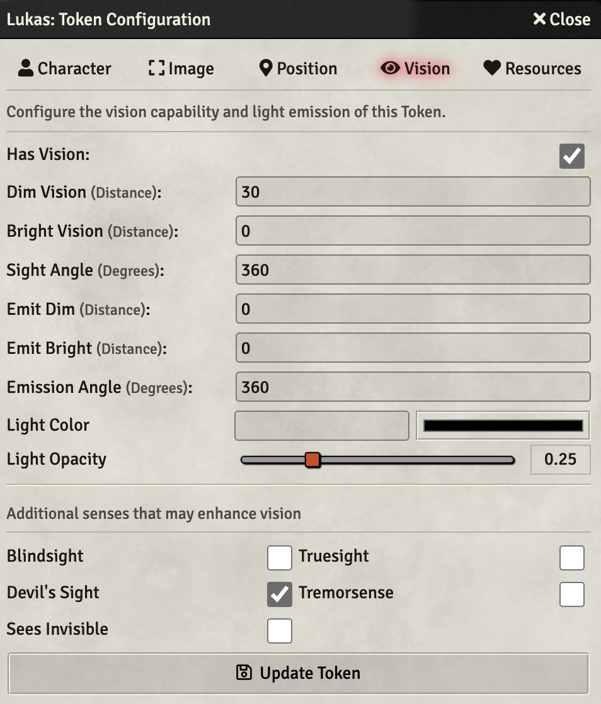

# Conditional Visibility

 

 

## THIS MODULE IS ABBANDONED (OR AT LEAST I WILL NOT DEVELOPING SOMETHING ON THE SHORT TERM) ANYONE IS FREE TO TAKE CHARGE ON THIS

Invisible Stalkers should only be seen by players that have cast See Invisibility.  Stealthy Goblins should only be seen by players with high perception.
And when that Drow casts Darkness, players should need Devil's Sight to see any tokens inside.

Conditional Visibility allows you to set conditions on tokens that will display them only to players whose senses meet the conditions necessary to see
the token.

## Installation

It's always easiest to install modules from the in game add-on browser.

To install this module manually:
1.  Inside the Foundry "Configuration and Setup" screen, click "Add-on Modules"
2.  Click "Install Module"
3.  In the "Manifest URL" field, paste the following url:
`https://raw.githubusercontent.com/p4535992/conditional-visibility/master/src/module.json`
4.  Click 'Install' and wait for installation to complete
5.  Don't forget to enable the module in game using the "Manage Module" button

### libWrapper

This module uses the [libWrapper](https://github.com/ruipin/fvtt-lib-wrapper) library for wrapping core methods. It is a hard dependency and it is recommended for the best experience and compatibility with other modules.

### socketlib

This module uses the [socketlib](https://github.com/manuelVo/foundryvtt-socketlib) library for wrapping core methods. It is a hard dependency and it is recommended for the best experience and compatibility with other modules.

## Usage

### Conditions

**Conditional Visibility** works by adding new conditions to the conditions panel, for Invisible, Obscured, In Magical Darkness, and Hidden (currently 5e Only).
It does not work for game systems that use their own condition systems, though discussion (and pull requests!) are certainly welcomed
from those more familiar with those systems.  Pathfinder 2e has partial support now, using the system's default Invisible condition.

### Invisible, Obscured, or Magical Darkness

When a token has one of these conditions, it can only be seen by a token with the proper senses configured in their Vision panel.

Put it together, it looks like this (click to play on YouTube):

### Hidden (currently 5e only)

When the hidden condition is selected, a stealth roll is automatically made, which can be customized before closing.  The token will only be seen by a token whose passive perception
exceeds that stealth roll. (click to play on YouTube):

### Other Ways of Applying conditions to a token

#### Scripting

New to version 0.0.8, script entry points are created for macro and script authors.  The following methods are supported:

`ConditionalVisibility.help()`

(GM only) pops up a dialog showing the current system, available conditions, and configuration status.

`ConditionalVisibility.setCondition(tokens, condition, value)`

* tokens - an array of tokens to affect
* condition - the name of the condition, e.g. invisible or indarkness.  You can check the available names for your system in the `help()` dialog.
* value true to turn the condition on, false to turn it off

For example, if you want to set all the selected tokens invisible:
`ConditionalVisibility.setCondition(canvas.tokens.controlled, 'invisible', true)`

The *hidden* condition requires system specific rules, and so uses a different set of methods.  Note this is only available on systems that have these rules developed, currently only D&D 5e.  Issues or contributions for other issues are welcome.

`ConditionalVisibility.hide(tokens, value)`
* tokens - a list of tokens to affect
* value - optional; a flat value to apply to all tokens.  If not specified, each token will make system-specific roll.

`ConditionalVisibility.unHide(tokens)`
* tokens - a list of tokens from which to remove the hidden condition. 

#### Auto-applied from Stealth Rolls

Conditional Visibility contains an setting to auto-apply the hidden condition based on a stealth roll.  Currently only 5e; again, contributions for other systems are welcomed.

When this setting is true, then rolling stealth from that token's character sheet will apply the hidden condition based on the value of that roll.

## Note for Combat Utility Belt Users
If you use Combat Utility Belt and check "Remove Default Status Effects," it will remove those Status Effects necessary for this module to function.  They can be re-added using Combat Utility Belt's Condition Lab:

If each condition is added to the CUB set, Conditional Visibility will again function, even if CUB has removed the default set.  The pairs would be:

Invisible

* modules/conditional-visibility/icons/unknown.svg

Obscured

* modules/conditional-visibility/icons/foggy.svg

In Darkness

* modules/conditional-visibility/icons/moon.svg

Hidden (5e only)

* modules/conditional-visibility/icons/newspaper.svg

# Known Issues

* Pathfinder 2e supports only the "Invisible" condition.
* Will not work if the hide regular conditions options of Combat Utility Belt is checked, as it hides the required Conditional Visibility conditions

## [Changelog](./CHANGELOG.md)

## Issues

Any issues, bugs, or feature requests are always welcome to be reported directly to the [Issue Tracker](https://github.com/p4535992/conditional-visibility/issues ), or using the [Bug Reporter Module](https://foundryvtt.com/packages/bug-reporter/).

## License

This package is under an [MIT license](LICENSE) and the [Foundry Virtual Tabletop Limited License Agreement for module development](https://foundryvtt.com/article/license/).

## Acknowledgements

Bootstrapped with League of Extraordinary FoundryVTT Developers  [foundry-vtt-types](https://github.com/League-of-Foundry-Developers/foundry-vtt-types).

**Icons by**

* unknown.svg, newspaper.svg, and foggy.svg icons made by <a href="https://www.flaticon.com/authors/freepik" title="Freepik">Freepik</a>, from <a href="https://www.flaticon.com/" title="Flaticon"> www.flaticon.com</a>
* moon.svg icon made by <a href="https://www.flaticon.com/authors/iconixar" title="iconixar">iconixar</a> from <a href="https://www.flaticon.com/" title="Flaticon"> www.flaticon.com</a>

## Credit

Thanks to anyone who helps me with this code! I appreciate the user community's feedback on this project!

Very special ty to [Szefo09](https://github.com/szefo09) for make a full operational patch for Dnd5e with FoundryVtt 0.8.6 and 9

Very special ty to [Teshynil](https://github.com/Teshynil) for make many and many test with bug fix
